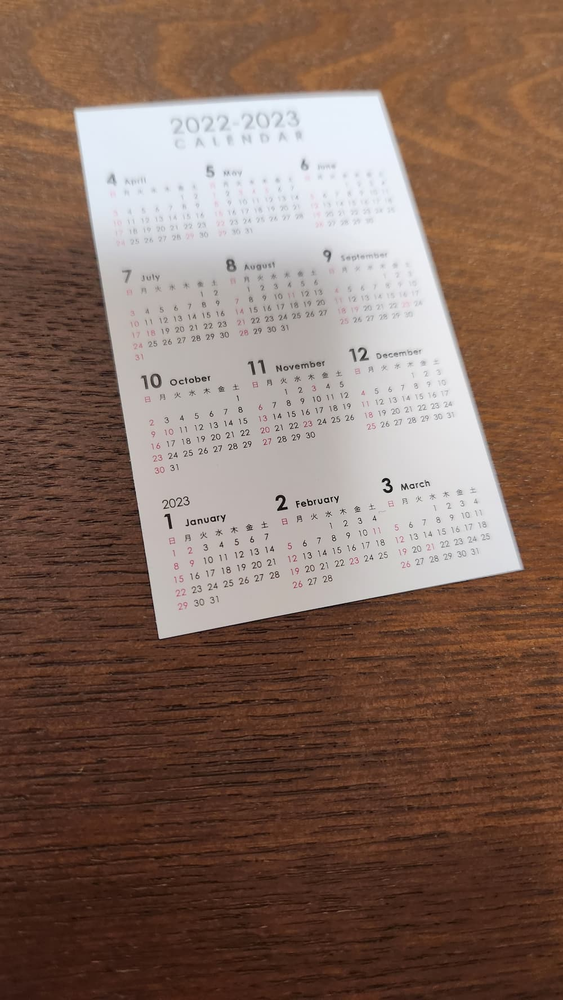
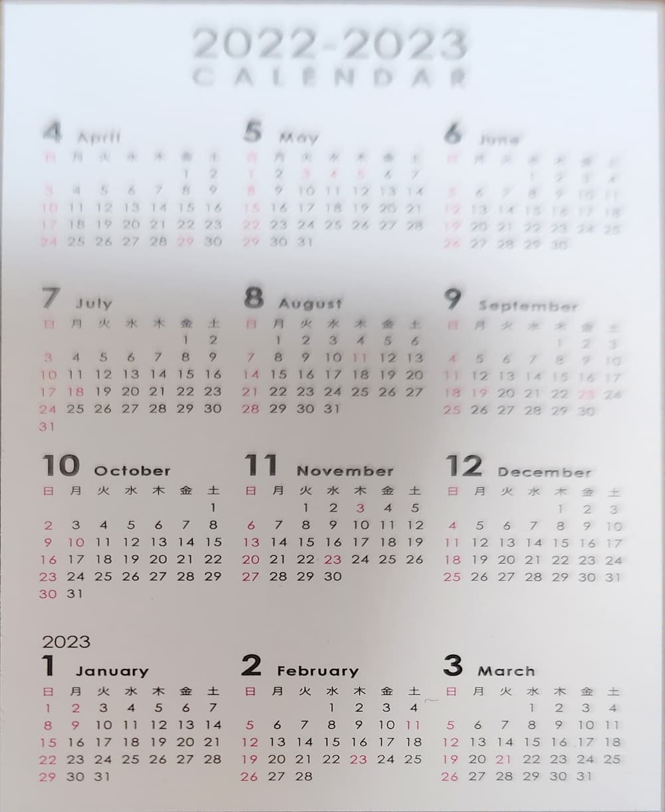

# Rectangle detection / Perspective transformation  

## Set environment  

```
python -m venv venv
source venv/bin/activate
pip install -r requirements.txt
```

## Detect rectangle and do perspective transformation  

```
python transform.py --load_dir [LOAD_DIR] --save_dir [SAVE_DIR] --ext [SEARCH_EXTENSION] --save_contour
```

## Sample  

|Input|Contour|Output|
|---|---|---|  
||||  

## Reference  

* [AVFoundation+OpenCVで矩形検出（「名刺撮影用カメラ」みたいなやつ作ってみました）](https://dev.classmethod.jp/articles/avfoundation-opencv-findcontours/)  
* [【OpenCV-Python】輪郭(contour)の面積(contourArea)](https://imagingsolution.net/program/python/opencv-python/contourarea/)  
* [【OpenCV-Python】findContoursによる輪郭検出](https://imagingsolution.net/program/python/opencv-python/opencv-python-findcontours/)  
* [opencv.approxPolyDP() による 画像から抽出された境界(輪郭)の直線近似](https://end0tknr.hateblo.jp/entry/20171105/1509845707)  
* [Python, OpenCVで幾何変換（アフィン変換・射影変換など）](https://note.nkmk.me/python-opencv-warp-affine-perspective/)  
